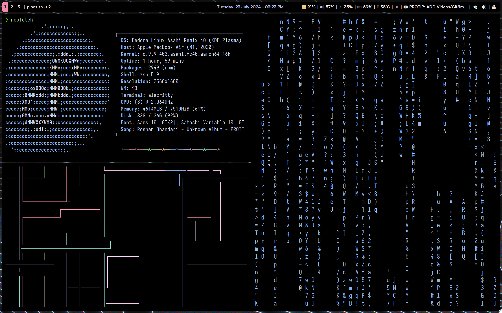
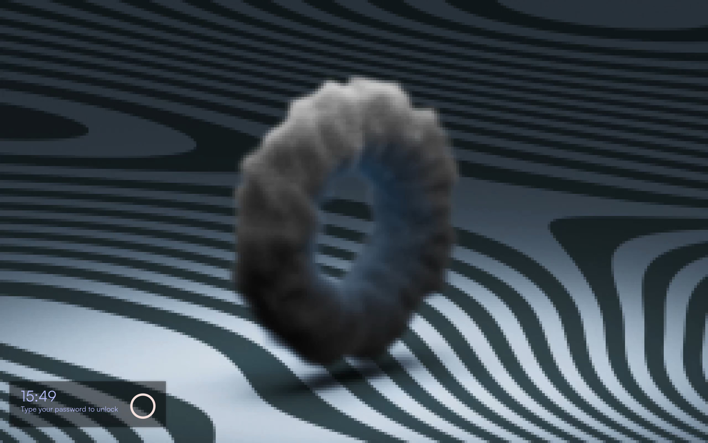

# dotfiles-asahi-linux

Minimal yet powerful dotfiles tailored for my personal Linux setup on Asahi Linux with `i3`, `neovim`, `zsh`, and more.

## Screenshots

- Desktop
<p align="center">
  
</p>

- Polybar
<p align="center">
  
</p>

- Lock Screen 
<p align="center">
  
</p>

---

## Features

- Window Manager: [i3wm](https://i3wm.org/)
- Terminal: [Alacritty](https://github.com/alacritty/alacritty)
- Shell: [Zsh](https://www.zsh.org/) with [Oh My Zsh](https://ohmyz.sh/)
  - Plugins: Syntax Highlighting, Autosuggestions, Bat, You Should Use
  - Theme: [Powerlevel10k](https://github.com/romkatv/powerlevel10k)
- Editor: [Neovim](https://neovim.io/) with `packer.nvim` and custom config
- Bar: [Polybar](https://github.com/polybar/polybar)
- Compositor: [Picom](https://github.com/yshui/picom)
- Extras: `btop`, `cava`, `tmux`, `feh`, `cmatrix`, `obs-studio`, etc.
- Fonts: Patched Nerd Fonts for icons and pretty terminal output

---

## Setup Instructions

> [!WARNING] 
> Warning: This script is written specifically for my environment (Asahi Linux + Fedora). Please read before running.

### 1. Clone the repo

```bash
mkdir ~/dev; cd ~/dev
git clone https://github.com/Yash2402/dotfiles.git
cd ~/dev/dotfiles
```

### 2. Run the setup script

```bash
chmod +x configuring-script.sh
./configuring-script.sh
```
---

## Folder Structure

```
dotfiles/
├── .config/
│   ├── i3/
│   ├── polybar/
│   ├── nvim/
│   └── ...
├── .zshrc
├── .Xresources
├── fonts/
├── tools/
│   ├── boomer
│   ├── autotilling
│   └── neofetch
└── configuring-script.sh
```

---

## Credits

- [Oh My Zsh](https://ohmyz.sh/)
- [Powerlevel10k](https://github.com/romkatv/powerlevel10k)
- [Neovim](https://neovim.io/)
- [Polybar](https://github.com/polybar/polybar)
- [Picom](https://github.com/yshui/picom)
- And many others from the open-source community

---

## TODO

- [ ] Add Wayland support (Sway configs?)
- [ ] Convert to dotbot or stow for modular install

---

## Maintained by [Yash Sharma](https://github.com/Yash2402)
